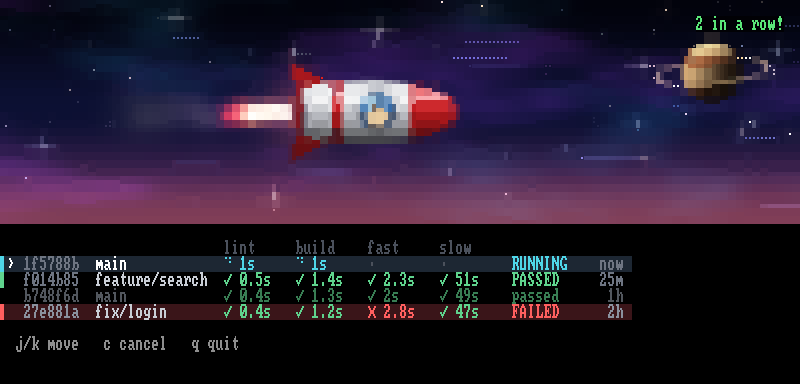
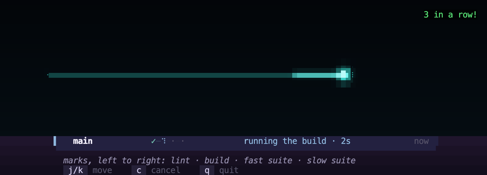
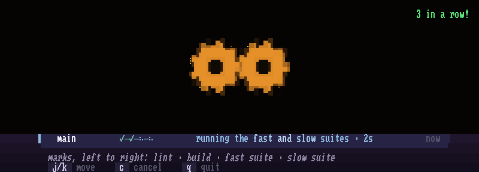
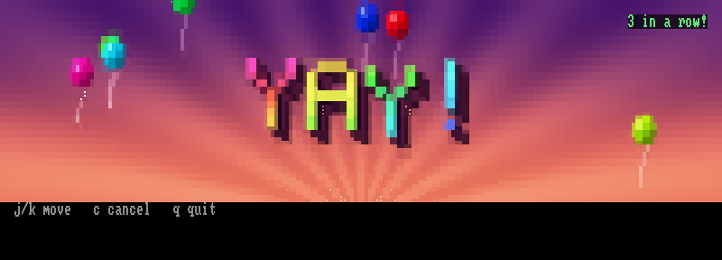
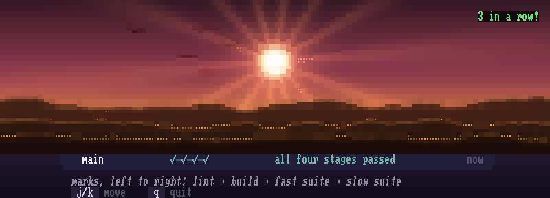
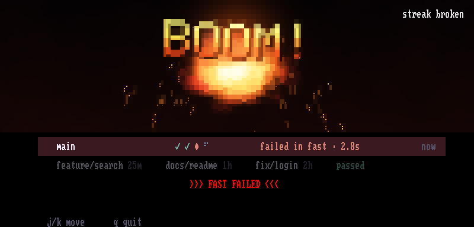
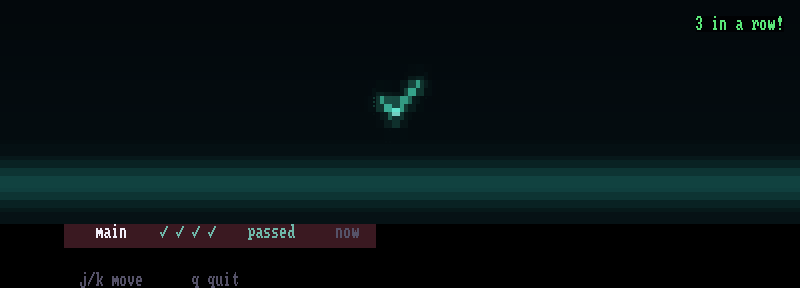
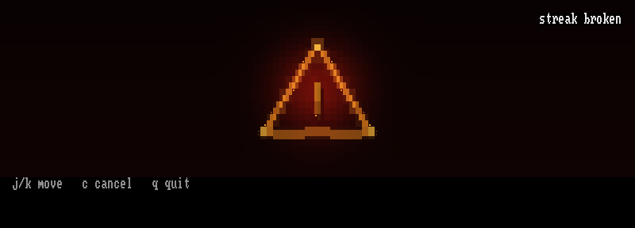
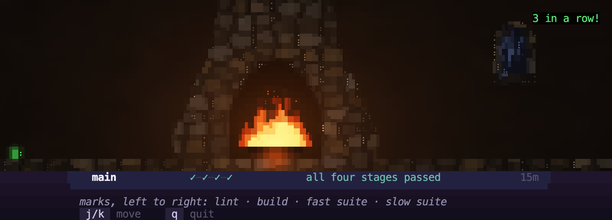
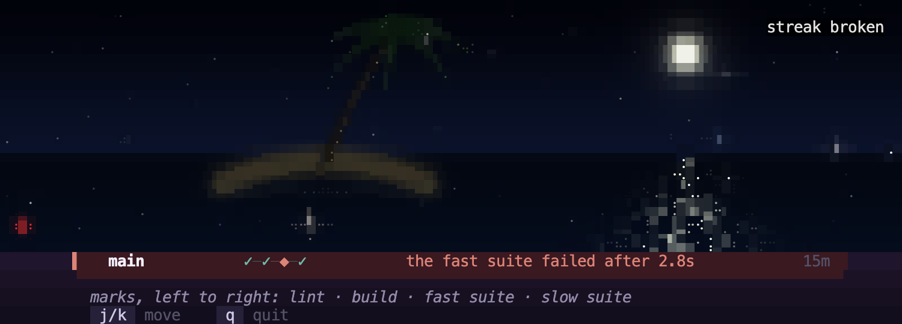

[](https://badge.fury.io/rb/fun_ci)

# Fun-CI

Opinionated local CI that checks your code before it leaves your machine. Every commit runs lint, build, a fast suite and a slow suite on your own computer, each held to a strict time budget, so the feedback stays fast.



Fun-CI has two goals. It should be extremely easy to tell whether all is well, and it should be fun. The design behind both is in [docs/design.md](docs/design.md).

There are two ways to use it, and both read the same results:

- **You watch.** `fun-ci console` sits on a second screen. Colour and motion tell you from the corner of your eye that lint passed, the build passed, the fast suite passed, or that something failed and you should look closer. A pass gets a celebration, a failure gets an explosion.
- **Your agent asks.** A coding agent can't glance at a screen, so it runs commands. `fun-ci wait` blocks until a commit's verdict is in and exits with it, and `fun-ci why` prints everything fun-ci kept about a failure, so the agent never has to rerun a suite to find out what broke.

## Getting started

```bash
gem install fun_ci
cd your-project
fun-ci init --everything
```

This detects your project type, writes four stage scripts into `.fun-ci/`, installs a `post-commit` and a `pre-push` git hook, and checks the setup. It also adds a short section to your `AGENTS.md` (or `CLAUDE.md`, if that is the only one) telling coding agents what to do after a commit.

`fun-ci init` has templates for Ruby, Gradle, Maven, Rust, Go, Elixir, Dart, Swift, PHP, .NET, Python, Deno, Bun, Node, Perl, and C or C++ built with CMake or make. [docs/stacks.md](docs/stacks.md) shows how it recognises each one and the commands it writes. Fun-CI works with any project: the stages are shell scripts, so edit them to run whatever your project uses.

- `lint.sh`: linter and static analysis
- `build.sh`: compile or build
- `fast.sh`: the fast suite (unit tests)
- `slow.sh`: the slow suite (integration tests)

Each script gets the commit hash as its first argument, its stage's name in `FUN_CI_STAGE`, and exits 0 to pass.

Upgrading from 1.x? Read [Upgrading to 2.0](#upgrading-to-20) first.

## How a run works

| Stage | Budget | Runs | Blocks |
|-------|--------|------|--------|
| Lint  | 30 s   | in parallel with build | the push |
| Build | 30 s   | in parallel with lint | the push |
| Fast  | 10 s   | after lint and build pass | the push |
| Slow  | 5 min  | in the background, beside the fast suite | nothing |

The fast and slow suites run at the same time on what the build left, so `build.sh` should compile everything they need, test code included; the scripts `fun-ci init` writes do. Otherwise both suites compile into the same build directory at once and can break each other's build.

A stage that overruns its budget is killed and reported as over budget, in yellow rather than red: a fast suite that takes 12 seconds has grown too heavy, which is a different problem from a failing test.

After each commit, the `post-commit` hook starts the pipeline in the background and returns at once, so a commit is never held up. The `pre-push` hook waits for the verdict of each commit you push and stops the push if lint, build or the fast suite failed. A commit whose run has already finished goes straight through. If fun-ci isn't installed, both hooks say so and let git carry on.

Each run happens in a git worktree of its own under `.git/fun-ci/worktrees/`, checked out at the commit it tests, so you can keep editing while it runs. Ignored files such as `vendor/bundle` or `node_modules` stay in a worktree from one run to the next, which keeps builds quick. Two runs can go at once; set `worktree_slots: 3` in `.fun-ci/config` for more, and `fun-ci prune` removes the worktrees when you want the space back. A newer commit on a branch cancels the older run that is still going, unless an agent is waiting on it.

Results are kept in SQLite under `$XDG_STATE_HOME/fun-ci/` (`~/.local/state/fun-ci/` by default), shared by every project on the machine.

## Watching: the console

```bash
fun-ci console
```

The console lists your runs across branches, newest first, one row each: the commit, the branch, each stage with its time, and the outcome. Above them is a picture that tells you what is happening without reading a word.

While a run runs, a rocket flies. Each milestone a run passes has its own set of scenes, so you can tell which one it was from across the room, and a failure has its own.

| | |
|---|---|
| Lint passed: a teal sweep, a ripple or a spirit level | The build passed: amber blocks, gears or a ringing anvil |
|  |  |
| The fast suite passed: a lightning strike, a very happy YAY or a jump to warp speed | The whole run passed: fireworks, a trophy, dancing leprechauns or a sunrise |
|  |  |

Scenes queue and each plays to its end, so a failure never cuts a celebration short, and a run gets one explosion however many of its stages fail.



When the scenes are done, the header rests on how the latest run went, so a glance a minute later still tells you: a calm tick after a pass, a pulsing hazard sign after a failure. The top right keeps count of the passes in a row.

| | |
|---|---|
|  |  |

Five minutes after the latest run finished, the header goes quiet: a starry night, an aurora, fireflies, a fire in a medieval stone hearth while a storm rages at the window, a moonlit island with a lone palm, or snow falling on a pine forest, changing every five minutes while nothing runs. A small lamp in the corner stays green after a pass and flickers red after a failure.

| | |
|---|---|
|  |  |

Keys:

- `j` and `k`, or the arrow keys, move the cursor down and up
- `c` cancels the run under the cursor: a scheduled one at once, a running one once you answer `y` (`n` or `Esc` keeps it running)
- `q` quits

The console is drawn in 24-bit colour when `COLORTERM` says the terminal has it (`truecolor` or `24bit`), and in 256 colours otherwise. The pictures above come from the renderer's headless mode, drawn with its own bitmap font; in your terminal the text is in your terminal's font.

The drawing is done by a separate program, `fun-ci-renderer`, written in Rust. The gem for Linux (x86_64, aarch64, musl) and macOS (arm64, x86_64) includes it. On other Unix-like systems you get the plain gem, where every command except `console` works; install the renderer with `cargo install fun-ci-renderer` (Rust 1.88 or newer), or point `FUN_CI_RENDERER` at a copy you built. Windows is not supported, because fun-ci forks its background pipeline, but WSL runs the Linux gem. When something goes wrong between the two, the details are in `.fun-ci/console.log`.

## Asking: commands for agents and scripts

Every commit's output ends with the command that gets its verdict:

```
fun-ci: testing 3f9c2ab. Verdict: fun-ci wait 3f9c2ab --need all
```

The section `fun-ci init` writes into `AGENTS.md` tells an agent to run that command in the background after each commit. Agent harnesses wake the agent when a background command exits, so it hears about a failure without having to remember to ask.

`status` says where a commit's run stands and `wait` blocks until it is decided. Both exit with the verdict for the stages you need: `--need build` (lint and build), `fast` (the default) or `all` (the slow suite too).

| Exit code | Meaning |
|---|---|
| 0 | Passed |
| 1 | A needed stage failed |
| 2 | A needed stage ran over budget |
| 3 | Still undecided (`wait --within 30s` gives up at your deadline) |
| 4 | Superseded by a newer commit on the branch (`wait --follow-branch` moves on to it) |
| 5 | No run for the commit |
| 64 | Usage error |

A failed stage comes with its evidence. `status` and `wait` end with a digest and the command that shows the rest:

```
$ fun-ci status
fun-ci: 2330979 "Add shipping to the cart total" on main
  lint   passed         0.6s
  build  passed         0.3s
  fast   FAILED         0.3s
  slow   passed         0.5s (not needed)
fast failed:
    1) Failure:
  CartTest#test_total_includes_shipping [test/cart_test.rb:16]:
  Expected: 104.95
    Actual: 99.95
fun-ci why 2330979 fast
```

`why` prints how the stage ended, each failure with its whole message and its own output, what the extractors picked out of the output and the log files, and anything that went wrong collecting it. `why --raw` prints the whole output. Every command takes `--json`.

```
$ fun-ci why 2330979 fast
fun-ci: 2330979 "Add shipping to the cart total" on main
fast failed (exit 1) after 0.2s, budget 10s

Minitest's failures and errors (output:9-12), from section:minitest:
    1) Failure:
  CartTest#test_total_includes_shipping [test/cart_test.rb:16]:
  Expected: 104.95
    Actual: 99.95

The output's last lines, from output-tail:
  Run options: --seed 20502
  ...
  3 runs, 3 assertions, 1 failures, 0 errors, 0 skips
  rake aborted!
  Command failed with status (1)
  ...

The whole output: fun-ci why 2330979 fast --raw
```

`fun-ci runs` lists recent runs one line each, and `fun-ci events --follow` prints each run's events as JSON lines as they happen, for a supervising agent or a status bar.

### What fun-ci keeps when a stage fails

With no configuration, fun-ci runs the presets for the tools your project has when a failure shows them. There are presets for the test runners, compilers, linters and type checkers of every stack `fun-ci init` knows, and for JSON logs from logstash-logback-encoder, ECS, pino and structlog; [docs/stacks.md](docs/stacks.md#presets) lists each one with what it picks out and when it runs. Each preset is checked against the recorded output of a real failing run of its tool. `fun-ci check` lists the ones that apply to your project.

To keep more, add entries under `evidence:` in `.fun-ci/config`:

```yaml
evidence:
  stages:
    fast:
      - use: junit-files         # each failure in the JUnit XML the stage wrote,
        paths: [build/test-results/test/*.xml]   # as file, line, test and message
      - use: log-file            # what the stage wrote to it, and only that
        path: log/test.log
        grep: ["ERROR"]
        context: 5
    slow:
      - run: .fun-ci/evidence/problems   # your own extractor, in any language:
        format: json                     # the context on stdin, JSON on stdout
      - run: pkill -QUIT -g "$FUN_CI_PGID" java   # a thread dump before an overrun is killed
        on: overrun
```

`fun-ci extract fast --output saved.log` runs a stage's extractors against a saved output (`fun-ci why --raw > saved.log`), so you can try an entry without making a commit. A mistake under `evidence:` never stops a pipeline: `fun-ci check` reports it and `fun-ci why` names it.

Secrets in the stage's environment are masked before anything is kept: the value of any variable whose name holds TOKEN, SECRET, PASSWORD, PASSWD, API_KEY, PRIVATE_KEY or CREDENTIAL, and GitHub, AWS and Slack tokens, private keys and `Authorization:` headers wherever they appear. The state directory is readable by your user alone.

## Commands

```
fun-ci init                                     Scaffold .fun-ci/ for the detected project type
fun-ci init --everything                        init + install-hooks + check in one step
fun-ci install-hooks                            Install post-commit and pre-push hooks
fun-ci install-hooks post-commit                Install a single hook type
fun-ci check                                    Verify .fun-ci/ setup
fun-ci console                                  Watch the runs
fun-ci status [commit]                          Where a commit's run stands; the verdict is the exit code
fun-ci wait [commit]                            Wait until that verdict is decided, then exit with it
fun-ci why [commit] [stage]                     Everything kept about why a stage failed
fun-ci runs                                     This project's recent runs, newest first
fun-ci events [--follow]                        The runs' events as JSON lines
fun-ci extract <stage> --output <file>          Try a stage's extractors on a saved output
fun-ci trigger <commit> <branch>                Run the whole pipeline in the foreground
fun-ci trigger --background <commit> <branch>   Start the pipeline in the background (what post-commit runs)
fun-ci prune                                    Remove fun-ci's worktrees when no pipeline is running
```

`fun-ci --help` lists every option.

## Upgrading to 2.0

- Run `fun-ci install-hooks` again. The background pipeline now runs after the commit (`post-commit`), so it tests the commit you just made; the `pre-commit` hook tested the one before it. Until you do, each run tests the commit before yours, and `fun-ci check` warns you. Installing removes the `pre-commit` hook fun-ci 1.x wrote and leaves a hook of your own alone (`fun-ci check` warns if yours still calls fun-ci). The new `pre-push` hook waits for the verdict instead of running the pipeline again.
- The stages run in a worktree at the commit, not in your checkout. A script that relied on uncommitted files in your checkout won't see them any more.
- The database moved from `$TMPDIR` to `$XDG_STATE_HOME/fun-ci/`. Runs recorded by 1.x are not carried over.
- `fun-ci-trigger` and `fun-ci-tui` are gone; use `fun-ci trigger` and `fun-ci console`. `fun-ci trigger --no-validate` still works until 2.1, as the old name for `--background`.
- The console needs `fun-ci-renderer`, which the platform gems include (see [Watching: the console](#watching-the-console)).

The whole list is in [CHANGELOG.md](CHANGELOG.md).

## Development

```bash
bundle install
bundle exec rake   # the gate: tests, the renderer's tests, the binary contract, rubocop, clippy
```

How it is built is in [docs/architecture.md](docs/architecture.md), and the requirements are in [docs/acceptance-tests.md](docs/acceptance-tests.md). The renderer is written in Rust; install Rust with [rustup](https://rustup.rs), which picks up the version the repository pins in `rust-toolchain.toml`. `ruby script/readme_screenshots.rb` draws the pictures in this README again.

## License

MIT
